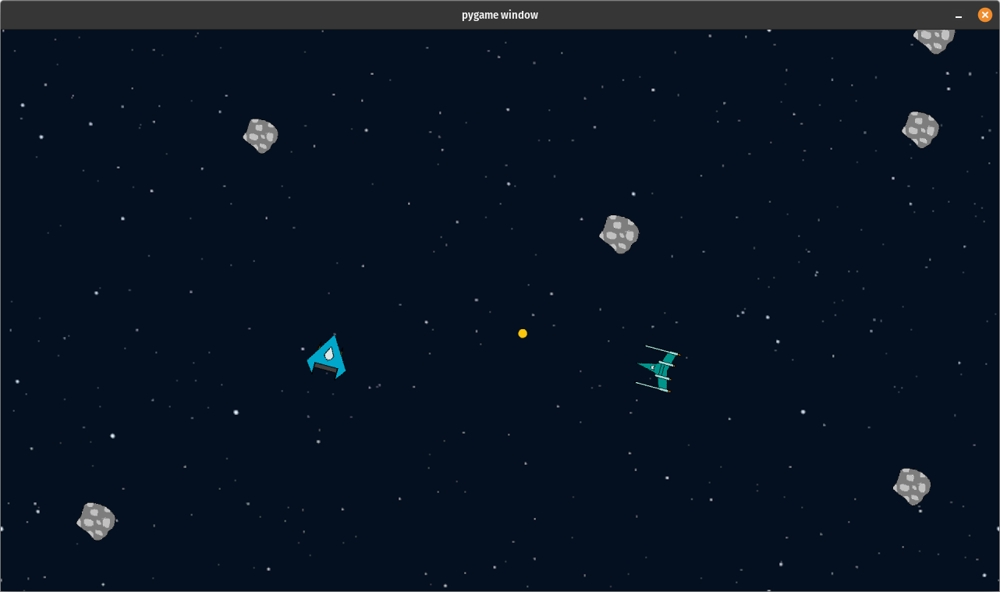

# Starfighters

Offline multiplayer (two players one computer) game inspired by [Asteroids](https://en.wikipedia.org/wiki/Asteroids_(video_game)). Written in Python as an ending project for OOP class with my friend Hugo4Git. Uses pygame.

Screenshots                                                    | Screenshots
:-------------------------------------------------------------:|:------------------------------------------------------------:
      | 
 | 

<!--  -->
<!--  -->
<!--  -->

## Running

1. Create virtualenv
```python3 -m venv venv```
2. Activate virtualenv (needed everytime when running the project)
```source venv/bin/activate```
3. Install dependencies
```pip install -r requirements.txt```
4. Run the game
```python3 src/main.py```

To deactivate the virtualenv use
```deactivate```

Tested with Python 3.10.12 on Ubuntu 22.04.

## Sources

- font in logo [https://www.fontspace.com/public-pixel-font-f72305](https://www.fontspace.com/public-pixel-font-f72305)
